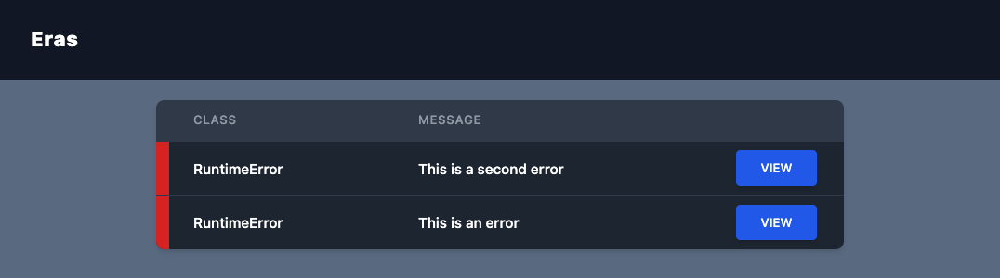
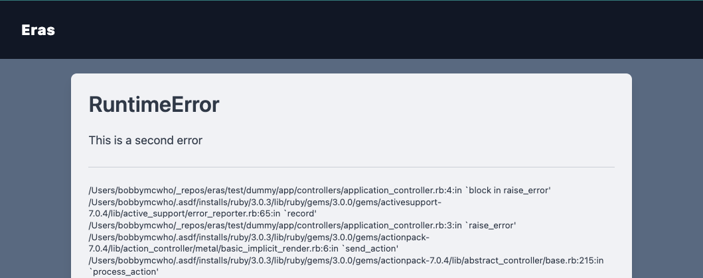

# Eras
Error reporting services such as Bugsnag, Honeybadger, and Sentry are great, but they oftentimes leave us scratching our heads while developing locally. You're most likely not sending the errors in development environment, but the notifier caught it anyways, and now it's gone *poof*, missing. Eras takes advantage of Rails 7.0's [`ActiveSupport::ErrorReporter`](https://api.rubyonrails.org/classes/ActiveSupport/ErrorReporter.html) 

### Index


### Show


## Installation
Add this line to your application's Gemfile:

```ruby
gem "eras", group: :development
```

And then execute:
```bash
$ bundle
```

mount the engine wherever you like (I prefer /eras)
```ruby
# config/routes.rb
mount Eras::Engine => "/eras" if defined?(Eras::Engine) # We only require this in development
```

## Disclaimer

This gem is in active development, and delivered as-is. 

## Contributing
You must run the tailwindcss server while developing, and commit any changes to `app/assets/builds`
```
rake tailwind_engine_watch
```

The gem is available as open source under the terms of the [MIT License](https://opensource.org/licenses/MIT).
